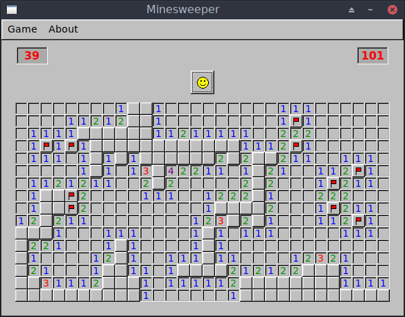

# Minesweeper Clone
Minesweeper clone that I wrote with C++ and the FLTK library. This was the final project for my first programming class so it may not be the most optimized or best looking code.

## Compiling

```
g++ $(fltk-config --cxxflags) -lfltk -lfltk_images main.cpp Tile.cpp Board.cpp
```

<p align="center"></p>